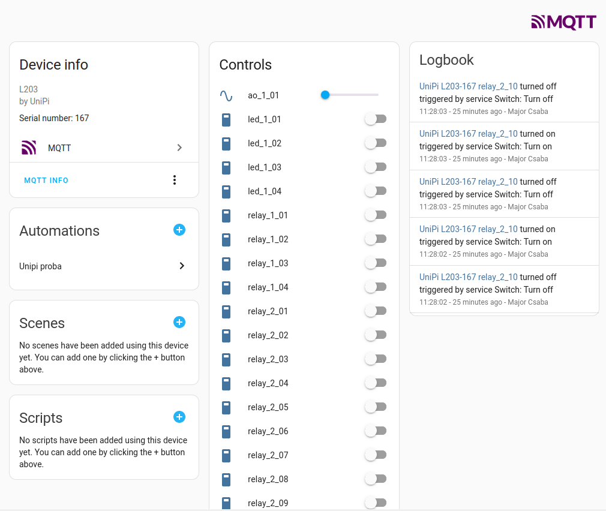

# UniPi to HomeAssistant bridge

------

UniPi2HA is a bridge between the [UniPi products](https://www.unipi.technology/) and [Home Assistant](https://www.home-assistant.io/). This tool tries to create all the devices and entities in Home Assistant without specifying the entities. This is done by the UniPi device list and the HomeAssistant MQTT discovery.

## Usage

The only information needed for the usage is the IP address of the UniPi device(s) and the IP address of the MQTT server which is used by HomeAssistant.

For example, if you have two UniPi devices, then you can start the script like this:

`unipi2ha.py --ha-ip 192.168.1.20 --unipi-ip 192.168.1.10 --unipi-ip 192.168.1.11`

This will automatically discover the two UniPi devices for their entities and the main devices and the belonging entities will be created automatically in HomeAssistant:

